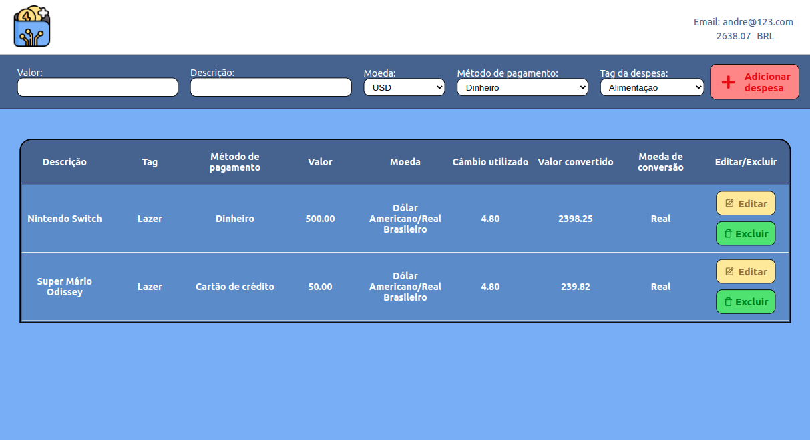

# Projeto TrybeWallet

Neste projeto, fomos responsáveis por criar uma aplicação que consome a API https://docs.awesomeapi.com.br/api-de-moedas e, com os dados retornados, gerenciar despesas da pessoa usuária. A aplicação conta com uma tela de login que verifica se o email digitado é válido e se a senha possui, no mínimo, 6 caracteres. 

Depois de logado, você é redirecionado para a página da tua carteira, onde você pode adicionar algum gasto e descrever quanto foi gasto, qual foi o gasto, qual foi o método de pagamento, qual foi a moeda utilizada e ainda uma tag específica.

Depois de adionar o gasto, é requisitado a API a cotação da moeda. Essa cotação consta na tabela e o valor, em Real (R$) do gasto também é calculado. Além disso, você pode também editar o gasto e também excluir, caso deseje.

Toda a aplicação foi feita com o React, utilizando o React Router Dom para criar uma Single Page Aplication; o React Dev Tools, para monitorar o desenvolvimento da aplicação; o React Icons, para adicionar ícones aos botões e o Redux Thunk, para criar actions assíncronas.

---

# Habilidades

- Criar um store Redux em aplicações React;

- Criar reducers no Redux em aplicações React;

- Criar actions no Redux em aplicações React;

- Criar dispatchers no Redux em aplicações React;

- Conectar Redux aos componentes React;

- Criar actions assíncronas na sua aplicação React que faz uso de Redux.

---

## Requisitos

Ao todo foram 10 requisitos:

#### 1. Crie uma página inicial de login;

#### 2. Crie uma página para sua carteira;

#### 3. Crie um header para a página de carteira;

#### 4. Implemente a lógica para armazenar no estado global as siglas das moedas que vêm da API;

#### 5. Desenvolva um formulário para adicionar uma despesa;

#### 6. Salve todas as informações do formulário no estado global;

#### 7. Desenvolva uma tabela com os gastos;

#### 8. Implemente a lógica para que a tabela seja alimentada pelo estado da aplicação;

#### 9. Crie um botão para deletar uma despesa da tabela;

#### 10. Crie um botão para editar uma despesa da tabela.